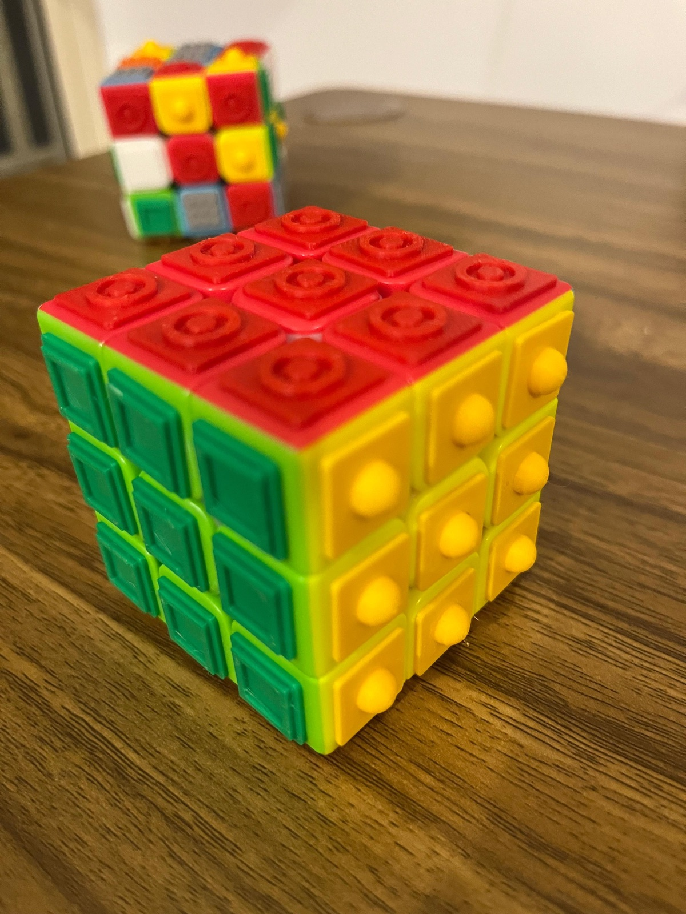

# LVC Dream Cube

**A colourful puzzle cube you can also solve by touch.**

Each colour on the cube gets its own 3D tactile pattern, so every face can be recognised through touch, not only sight. We 3D-printed small pattern chips and glued them onto an ordinary 3×3 puzzle cube. That's the whole trick, and this repo has everything you need to make one.

🌐 **Landing page:** https://bytesbrains.github.io/lvc-dream-cube/
🚀 **Kickstarter:** coming soon (watch or star this repo to hear when it goes live)

<p align="center">
  
</p>

## Who it's for

- **Colour-vision differences:** texture works alongside colour, so a player never has to guess red from green.
- **Blind and visually impaired players:** the whole puzzle can be explored and solved by touch.
- **Everyone else:** close your eyes or play in the dark, and it turns into a new challenge of touch, spatial memory and focus.

The LVC Dream Cube is the first prototype from **LVC Dream**, the accessibility vision inside [Little Voice Club](https://littlevoice.club). We don't want to build a separate little world of "accessible products". We want the things everyone already loves (toys, games, learning tools, art materials) to work for more people through thoughtful design.

## The tactile key

| Colour | Texture | Feels like | Model file |
|---|---|---|---|
| ⬜ White | **Smooth** | Flat chip, no relief | [`rubik_36x_smooth_white.3mf`](models/rubik_36x_smooth_white.3mf) |
| 🟩 Green | **Frame** | Raised square border | [`rubik_36x_frame_green.3mf`](models/rubik_36x_frame_green.3mf) |
| 🟧 Orange | **Ridges** | Diagonal ridges | [`rubik_36x_ridges_orange.3mf`](models/rubik_36x_ridges_orange.3mf) |
| 🟥 Red | **Rings** | Concentric circles | [`rubik_36x_rings_red.3mf`](models/rubik_36x_rings_red.3mf) |
| 🟦 Blue | **Dots** | A grid of small bumps | [`rubik_36x_dots_blue.3mf`](models/rubik_36x_dots_blue.3mf) |
| 🟨 Yellow | **Dome** | One large rounded bump | [`rubik_36x_dome_yellow.3mf`](models/rubik_36x_dome_yellow.3mf) |

The textures are chosen to feel clearly different from one another, going from flat (white) up to the tallest relief (yellow dome).

## What's in this repo

```
models/
  rubik_all54_tiles.3mf        # one full cube: 9 chips of each texture, one plate
  rubik_36x_<texture>_<colour>.3mf   # 36 chips of one texture (enough for 4 cubes)
docs/                          # the GitHub Pages landing page
PRINTING.md                    # print settings and assembly guide
```

Every chip is a **12 × 12 mm** square on a 1 mm base. The per-colour plates lay chips out in a 6 × 6 grid at a 15.5 mm pitch. The files are 3MF meshes exported from OpenSCAD and open in any modern slicer (PrusaSlicer, Bambu Studio, OrcaSlicer, Cura).

## Make your own

1. Get an ordinary 3×3 puzzle cube. Measure one sticker; the chips are 12 mm, which fits a standard 57 mm cube.
2. Print either `rubik_all54_tiles.3mf` (single-colour print, one cube) or the six per-colour plates in matching filament.
3. Glue each chip onto the matching colour, then check every face by touch before you play.

Full instructions, including the settings we recommend, are in [PRINTING.md](PRINTING.md).

## Build with us

We'd love to work with toy makers, accessibility researchers, educators, designers, manufacturers and brands on testing this idea with the communities it's meant for, and on making accessible products at scale.

- Printed one? [Share a photo or feedback](https://github.com/bytesbrains/lvc-dream-cube/issues/new?template=i-made-one.md).
- Have a better texture, a new chip size or a braille variant? See [CONTRIBUTING.md](CONTRIBUTING.md).
- Want to partner or manufacture? Email **hello@littlevoice.club**.

## License

The design files, photos and documentation are released under [Creative Commons Attribution 4.0 (CC BY 4.0)](LICENSE). You may print, remix, sell and manufacture them. Just credit **LVC Dream / Little Voice Club** and link back to this repository.

"Little Voice Club", "LVC Dream" and the Little Voice Club logo are trademarks and are not covered by the licence.

*LVC Dream: imagine, build and play for everyone.* 🌈
